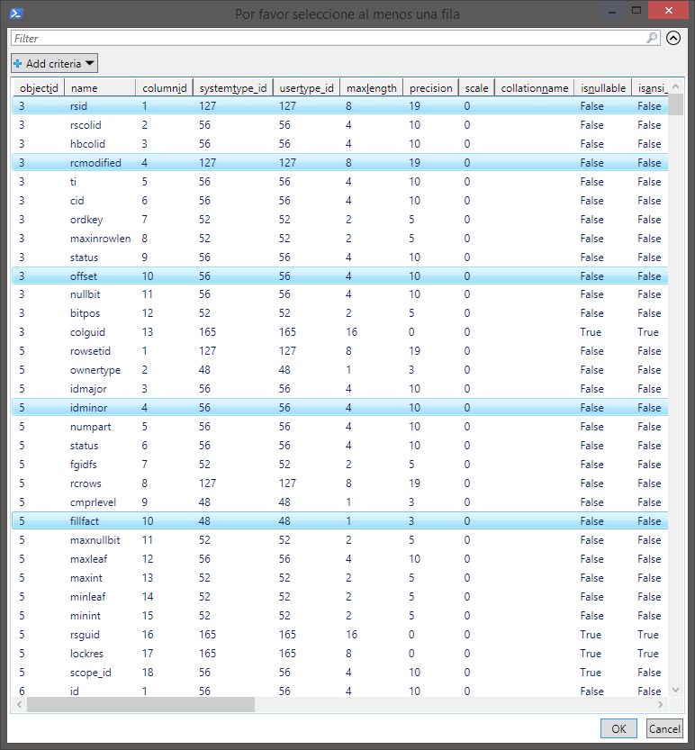

# New-QueryPickerDialog

## SYNOPSIS
Envía la salida de una consulta T/SQL a una ventana, permitiendo al usuario seleccionar una o más filas en dicha ventana.

## SYNTAX

```
New-QueryPickerDialog [-ConnectionString] <String> [-CommandText] <String> [[-CommandType] <CommandType>]
 [[-ArgumentList] <PSObject>] [[-Title] <String>] [[-OutputMode] <String>]
```

## DESCRIPTION
Se conecta con un origen de datos de T/SQL Server, y envía la salida de una consulta SQL a una ventana, permitiendo al usuario seleccionar una o más filas en la ventana.



## EXAMPLES

### -------------------------- EXAMPLE 1 --------------------------
```
New-QueryPickerDialog -ConnectionString 'Data Source=(local);Initial Catalog=Master;Integrated Security=True' -CommandText 'select * from sys.databases'
```

### -------------------------- EXAMPLE 2 --------------------------
```
New-QueryPickerDialog -ConnectionString 'Data Source=(local);Initial Catalog=Master;Integrated Security=True' -CommandText 'select * from sys.databases' -OutputMode 'Multiple'
```

### -------------------------- EXAMPLE 3 --------------------------
```
New-SqlConnectionDialog | New-QueryPickerDialog -CommandText 'select * from master.sys.databases' -OutputMode 'Multiple'
```

### -------------------------- EXAMPLE 4 --------------------------
```
New-SqlConnectionDialog | New-QueryPickerDialog -CommandText 'select * from master.sys.databases where user_access = @user_access' -ArgumentList @{user_access=0}
```

### -------------------------- EXAMPLE 5 --------------------------
```
'Data Source=(local);Initial Catalog=Master;Integrated Security=True' | New-QueryPickerDialog -CommandText 'select @@SERVERNAME as ServerName' -Title 'Hello World'
```

## PARAMETERS

### -ConnectionString
Establece la cadena de conexión que se utiliza para conectar con el origen de datos.

```yaml
Type: String
Parameter Sets: (All)
Aliases: 

Required: True
Position: 1
Default value: None
Accept pipeline input: True (ByValue)
Accept wildcard characters: False
```

### -CommandText
Establece la instrucción T/SQL, nombre de tabla o procedimiento almacenado para ejecutar en el origen de datos.

```yaml
Type: String
Parameter Sets: (All)
Aliases: 

Required: True
Position: 2
Default value: None
Accept pipeline input: False
Accept wildcard characters: False
```

### -CommandType
Especifica cómo se interpreta $CommandText (StoredProcedure, TableDirect, Text).
Valor predeterminado Text.

```yaml
Type: CommandType
Parameter Sets: (All)
Aliases: 
Accepted values: Text, StoredProcedure, TableDirect

Required: False
Position: 3
Default value: Text
Accept pipeline input: False
Accept wildcard characters: False
```

### -ArgumentList
Establece los valores de los parámetros que se reemplazan en $CommandType.

```yaml
Type: PSObject
Parameter Sets: (All)
Aliases: 

Required: False
Position: 4
Default value: None
Accept pipeline input: False
Accept wildcard characters: False
```

### -Title
Establece el texto que aparece en la barra de título de la ventana.

```yaml
Type: String
Parameter Sets: (All)
Aliases: 

Required: False
Position: 5
Default value: $Script:Resx.QueryPickerSelectAnObjectTitle
Accept pipeline input: False
Accept wildcard characters: False
```

### -OutputMode
Establece cuántos elementos se pueden seleccionar en la ventana  (Single: uno, Multiple: Varios).
Valor predeterminado Single.

```yaml
Type: String
Parameter Sets: (All)
Aliases: 

Required: False
Position: 6
Default value: Single
Accept pipeline input: False
Accept wildcard characters: False
```

## INPUTS

Puede canalizar el valor de ConnectionString.

## OUTPUTS

Array de PSObject con el(los) objeto(s) seleccionado(s).

## NOTES
Autor: Atorres

## RELATED LINKS

[New-SqlConnectionDialog](New-SqlConnectionDialog.md)

